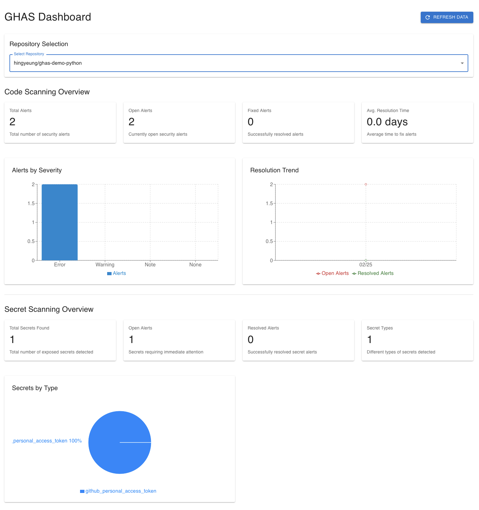

# GitHub Advanced Security (GHAS) Dashboard

> ⚠️ **SECURITY WARNING**: This is a proof-of-concept application and is NOT suitable for production use. The GitHub Personal Access Token (PAT) is exposed in the frontend code and can be viewed in the browser's network requests. In a production environment, all GitHub API calls should be proxied through a backend server to protect sensitive credentials.

A React-based dashboard for visualizing GitHub Advanced Security metrics across your repositories. This proof-of-concept application provides an intuitive interface for monitoring code scanning alerts, secret scanning, and security trends.

## Features

- **Repository Selection**: Easy switching between different repositories
- **Code Scanning Analytics**:
  - Total, open, and fixed alerts overview
  - Severity-based alert distribution
  - Average time to resolution metrics
  - Resolution trend analysis
- **Secret Scanning Insights**:
  - Active and resolved secret alerts
  - Distribution by secret type
  - Resolution rate tracking
- **Real-time Data**: Manual refresh capability for up-to-date security metrics
- **Responsive Design**: Works seamlessly across desktop and tablet devices

## Dashboard Preview



## Prerequisites

- Node.js (v18 or higher)
- npm or yarn
- GitHub Personal Access Token (PAT) with the following permissions:
  - `security_events`: Read access to security events
  - `repo`: Full control of private repositories

## Setup

1. Clone the repository:
   ```bash
   git clone https://github.com/hingyeung/ghas-dashboard-demo.git
   cd ghas-dashboard-demo
   ```

2. Install dependencies:
   ```bash
   npm install
   ```

3. Create a `.env` file in the root directory:
   ```env
   VITE_GITHUB_TOKEN=your_github_personal_access_token
   ```

4. Start the development server:
   ```bash
   npm run dev
   ```

5. Open [http://localhost:3000](http://localhost:3000) in your browser

## Configuration

### Repository List

The list of available repositories is currently hardcoded in `src/components/common/RepositorySelector.tsx`. Update the `AVAILABLE_REPOSITORIES` array to include your repositories:

```typescript
const AVAILABLE_REPOSITORIES: Repository[] = [
  { id: 1, name: 'repo-name', full_name: 'owner/repo-name' },
  // Add more repositories as needed
];
```

### Environment Variables

- `VITE_GITHUB_TOKEN`: GitHub Personal Access Token for API authentication

## Available Scripts

- `npm run dev`: Start development server
- `npm run build`: Build for production
- `npm run lint`: Run ESLint
- `npm run preview`: Preview production build locally

## Technical Stack

- **Frontend Framework**: React 18 with TypeScript
- **Build Tool**: Vite
- **State Management**: React Query for API state
- **UI Components**: Material-UI (MUI)
- **Data Visualization**: Recharts
- **API Integration**: Octokit (GitHub REST API client)

## Project Structure

```
src/
  ├── components/          # Reusable UI components
  │   ├── charts/         # Data visualization components
  │   ├── common/         # Shared components
  │   └── metrics/        # Metric display components
  ├── hooks/              # Custom React hooks
  ├── services/           # API and business logic
  ├── types/              # TypeScript definitions
  └── views/              # Main application views
```

## Best Practices

- Update the GitHub token regularly for security
- Monitor API rate limits when adding more repositories
- Keep the repository list updated with active repositories
- Check the GitHub Advanced Security documentation for API changes

## Contributing

1. Fork the repository
2. Create your feature branch (`git checkout -b feature/AmazingFeature`)
3. Commit your changes (`git commit -m 'Add some AmazingFeature'`)
4. Push to the branch (`git push origin feature/AmazingFeature`)
5. Open a Pull Request

## Known Limitations

- **SECURITY**: GitHub PAT is exposed in frontend code and network requests
- **NO PRODUCTION USE**: This code is for demonstration purposes only
- Currently supports a fixed list of repositories
- Refreshes all data at once (no partial updates)
- Limited to GitHub REST API capabilities
- No persistent storage of historical data
- No backend proxy to secure API calls

## Future Enhancements

- Dynamic repository discovery and selection
- Advanced filtering and search capabilities
- Custom date range selection for metrics
- Export functionality for reports
- Historical trend analysis
- Custom alert thresholds
- Team and organization-level views

## License

This project is licensed under the MIT License - see the LICENSE file for details.

## Support

For questions and support, please open an issue in the GitHub repository.